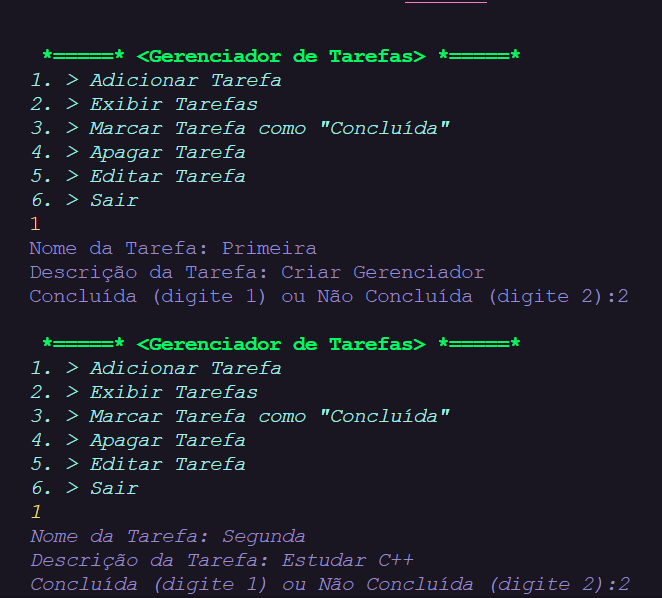
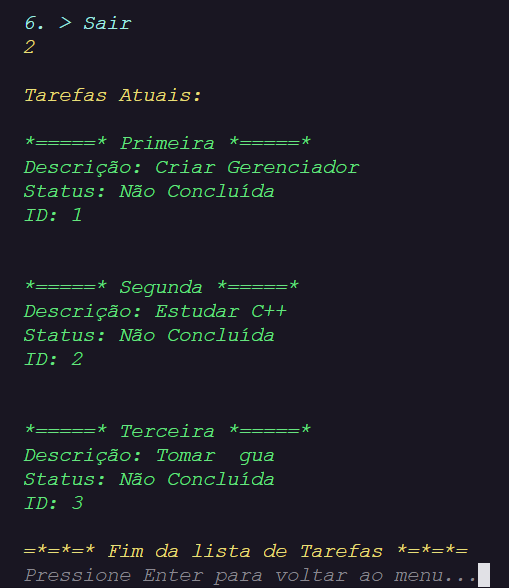
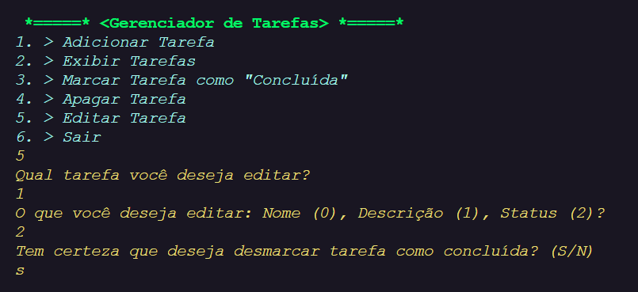

<h1 align="center"> Gerenciador de Tarefas </h1>

Um simples Gerenciador de Tarefas em Java.

  <a href="#-layout">Layout</a>&nbsp;&nbsp;&nbsp;|&nbsp;&nbsp;&nbsp;
  <a href="#-tecnologias">Tecnologias</a>&nbsp;&nbsp;&nbsp;|&nbsp;&nbsp;&nbsp;
  <a href="#-descrição">Descrição</a>

  

 

## 📒 _Layout_

### _Adicione uma tarefa:_

   
  

    
  

   

### _Exiba suas tarefas:_

   
  

    
  

   

 
  ### _Edite suas tarefas:_
   
  

    
  

## 🚀 _Tecnologias_

Esse projeto desenvolvido com:

- Java
- Git/Github
- ChatGPT-4-turbo (A ideia/descrição do problema foi provida pelo ChatGPT)

## 🔱 _Descrição_

(Provida pelo ChatGPT-4-turbo)

Projeto: Gerenciador de Lista de Tarefas
Descrição do Problema
Você deve criar um programa em Java que gerencie uma lista de tarefas simples. O programa deve permitir que o usuário realize as seguintes operações:

Adicionar uma nova tarefa: O usuário insere o nome de uma tarefa, que é adicionada à lista.

Exibir todas as tarefas: Mostre as tarefas em formato de lista, indicando quais estão concluídas e quais não estão.

Marcar uma tarefa como concluída: O usuário seleciona uma tarefa pelo número e ela é marcada como concluída.

Remover uma tarefa: O usuário seleciona uma tarefa pelo número e ela é removida da lista.

Encerrar o programa: Saia do programa quando o usuário escolher.
Requisitos

Cada tarefa deve ter:

1. Um nome.
2. Um status (concluída ou não).
3. O programa deve apresentar um menu interativo com as opções acima.
4. Se o usuário tentar realizar uma ação com um número inválido de tarefa, exiba uma mensagem de erro amigável.
5. O programa deve rodar em loop até o usuário escolher sair.
Desafios Adicionais (opcional)
6. Permita que o usuário edite o nome de uma tarefa existente.
Salve as tarefas em um arquivo para que possam ser carregadas ao reabrir o programa.
